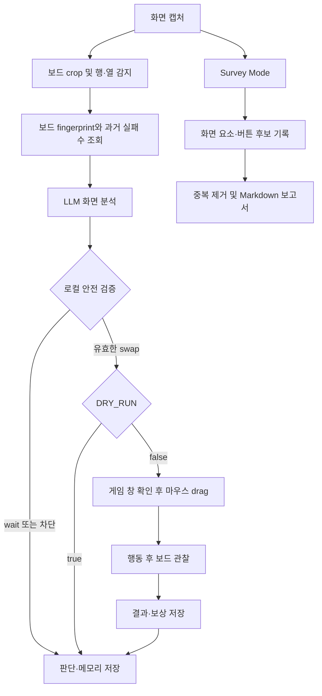

# Candy Crush Soda LLM Agent

Candy Crush Soda 화면을 캡처해 비전 LLM으로 분석하고, 로컬 안전 검증을 통과한 인접 셀 `swap`을 실행하는 데스크톱 실험용 에이전트입니다. 행동 뒤 보드 변화를 관찰해 실패한 수를 기억하며, 별도의 **Survey Mode**로 화면·버튼·보상·부스터 같은 게임 구조를 수집해 Markdown 보고서로 만들 수 있습니다.

기본값은 `DRY_RUN=true`입니다. LLM 분석과 좌표 검증은 수행하지만 실제 마우스 입력은 하지 않습니다.

## 현재 구현 상태

| 영역 | 상태 | 설명 |
| --- | --- | --- |
| 화면 캡처 | 구현 | MSS로 보드, 게임 창 또는 모니터 캡처 |
| 보드 크기 감지 | 구현 | 반복 경계로 행·열을 추정하고 실패하면 고정값 사용 |
| 행동 추천 | 구현 | OpenAI 비전 모델의 구조화 응답으로 `wait` 또는 `swap` 선택 |
| 로컬 안전 검증 | 구현 | UI 상태, 보드 안정성, 좌표 범위, 인접성, 최소 확신도 검사 |
| 실제 마우스 조작 | 선택적 구현 | `DRY_RUN=false`이고 게임 창을 확인한 경우에만 드래그 |
| 결과 관찰·메모리 | 구현 | 화면 변화로 결과를 분류하고 실패한 수와 역방향 수를 제외 |
| 게임 구조 조사 | 구현 | 화면 요소와 안전·위험 버튼 후보를 기록하고 보고서 생성 |
| 영상 분석 | 현재 미포함 | 과거 파이프라인은 제거되었으며 필요하면 별도 모듈로 복원 가능 |
| 규칙 기반 최적 솔버 | 미구현 | 가능한 수 전체의 점수·목표 달성도를 계산하지 않음 |

## 동작 흐름



플레이 모드의 행동 결과는 다음처럼 처리합니다.

| 결과 | 의미 | 보상 | 후속 처리 |
| --- | --- | ---: | --- |
| `accepted` | 최종 보드 변화가 기준 이상 | `+1` | 정상 진행 |
| `rejected` | 변화가 생겼다가 원래 보드로 복귀 | `-1` | 같은 수와 역방향 수 제외 |
| `no_change` | 의미 있는 변화가 없음 | `-1` | 같은 수와 역방향 수 제외 |
| `unclear` | 제한 시간 안에 결과가 안정되지 않음 | `0` | 판단 보류 |

포커스, 권한, 마우스 제어 오류 같은 실행 환경 문제는 게임 규칙 실패로 학습하지 않고 보상 `0`으로 저장합니다.

## 설치

Python 3.9 이상의 데스크톱 환경에서 가상환경을 만든 뒤 의존성을 설치합니다.

```bash
python3 -m venv .venv
source .venv/bin/activate
python -m pip install -r candy_soda_agent/requirements.txt
cp candy_soda_agent/.env.example candy_soda_agent/.env
```

Windows PowerShell에서는 가상환경 활성화 명령으로 `.\.venv\Scripts\Activate.ps1`을 사용합니다.

## 설정

`candy_soda_agent/.env`에 API와 실행 정책을 설정합니다. 이 파일은 Git에서 제외되므로 실제 API 키를 커밋하지 마세요.

```env
OPENAI_API_KEY=
OPENAI_MODEL=gpt-5-mini
OPENAI_SURVEY_MODEL=gpt-4o-mini
FULL_IMAGE_DETAIL=low
BOARD_IMAGE_DETAIL=high
LLM_MAX_OUTPUT_TOKENS=600
SURVEY_LLM_MAX_OUTPUT_TOKENS=900
AUTO_GRID=true
CAPTURE_MODE=window
DRY_RUN=true
GAME_WINDOW_TITLE=BlueStacks
SURVEY_ALLOW_TAPS=false
SURVEY_MIN_BUTTON_CONFIDENCE=0.60
SURVEY_DEDUP_SCAN_LIMIT=500
```

주요 환경변수는 다음과 같습니다.

| 설정 | 설명 |
| --- | --- |
| `CAPTURE_MODE` | `board`, `window`, `monitor` 중 LLM에 보낼 화면 범위 |
| `DRY_RUN` | `true`면 실제 마우스 입력 차단 |
| `GAME_WINDOW_TITLE` | 실제 입력 전에 확인할 앱 이름. 실동작 시 필수 |
| `AUTO_GRID` | 이미지 기반 행·열 자동 감지 사용 여부 |
| `FULL_IMAGE_DETAIL`, `BOARD_IMAGE_DETAIL` | 전체 UI와 보드 이미지의 API detail 수준 |
| `SURVEY_ALLOW_TAPS` | 조사 모드에서 안전 후보 버튼 탭 허용 여부 |
| `OPENAI_MODEL` / `OPENAI_SURVEY_MODEL` | 플레이 모드(다음 수 추론, reasoning 모델 필요)와 조사 모드(구조 문서화만, reasoning 불필요)는 필요한 모델이 달라 따로 설정합니다. 기본값은 `gpt-5-mini` / `gpt-4o-mini` |

화면 좌표와 감지 임계값은 `candy_soda_agent/config.py`에서 관리합니다.

- `MONITOR_INDEX`: 게임이 표시되는 모니터 번호
- `BOARD_OFFSET`: 선택한 모니터 기준 보드 영역
- `WINDOW_OFFSET`: `CAPTURE_MODE=window`에서 사용할 게임 창 영역
- `ROWS`, `COLS`: 자동 그리드 감지 실패 시 사용할 행·열 수
- `STABLE_THRESHOLD`, `NEW_BOARD_THRESHOLD`: 안정 화면과 새 보드 판단 기준
- `MAX_API_CALLS`, `API_COOLDOWN`: 자동 모드의 호출 상한과 최소 간격

레이아웃이나 해상도가 바뀌면 `BOARD_OFFSET`과 `WINDOW_OFFSET`을 다시 맞춰야 합니다. 자동 그리드는 행·열 수만 찾으며 보드의 화면 위치는 자동으로 찾지 않습니다.

## 실행

저장소 루트에서 `make`만 실행하면 모든 실행 명령을 확인할 수 있습니다. `Makefile`을 실행 명령의 단일 진입점으로 사용합니다.

```bash
# 처음 한 번만 실행: 가상환경·의존성 설치, .env 예시 파일 복사
make setup

# 가능한 명령과 설명 확인
make

# 캡처/보정
make preview
make calibrate

# 플레이
make once
make auto

# 구조 조사 및 보고서
make survey-once
make autodrive
make autodrive STEPS=20
make survey-report

# 단축키 모드와 테스트
make hotkeys
make test
```

기본 파이썬 경로는 `.venv/bin/python`입니다. 다른 가상환경을 쓴다면 `make once PYTHON=python3`처럼 `PYTHON`을 넘길 수 있습니다. `make survey-auto`는 기존 `--survey-auto --survey-taps` 조합을 유지한 호환 명령입니다.

`--hotkeys`를 함께 사용하면 F8은 한 번 분석, F9는 자동 분석 시작·중지, ESC는 종료입니다. macOS에서는 단축키 라이브러리 문제를 피하기 위해 `--once` 또는 `--auto`를 권장합니다. `--autodrive`/`--survey-auto`와도 함께 쓸 수 있으며, 이때는 ESC만 의미가 있고(F8/F9는 대상 없음) 누르면 진행 중이던 탭까지 취소하고 지금까지 기록으로 보고서를 남긴 뒤 멈춥니다.

실제 동작 전에는 반드시 `DRY_RUN=true`로 캡처 영역, 격자 번호, 추천 좌표를 확인하세요. `DRY_RUN=false`에서는 `GAME_WINDOW_TITLE`이 필요하며, macOS에서는 실행 앱에 **화면 기록**과 **손쉬운 사용** 권한을 부여해야 합니다.

`--survey-once`는 현재 화면만 기록합니다. `--autodrive`는 화면마다 같은 Survey 기록을 남기면서 실제 전환 그래프를 갱신합니다. `--survey-auto`는 호환 별칭이며, 실제 탭에는 `DRY_RUN=false`와 `SURVEY_ALLOW_TAPS=true` 또는 `--survey-taps`가 필요합니다. 구매, 광고 시청, 로그인, 계정 연결, 권한 요청 후보는 기록만 하고 누르지 않습니다.

## 저장 결과

출력 경로는 명령을 실행한 현재 디렉터리를 기준으로 정해집니다. 저장소 루트에서 실행하는 것을 권장합니다.

```text
output/
├── preview_raw.png            보드 캡처 미리보기
├── preview_grid.png           격자 오버레이 미리보기
├── captures/                  분석 전후 및 조사 증거 이미지
├── runs.jsonl                 LLM 판단, 그리드, 검증 결과
├── game_survey.jsonl          게임 구조 조사 기록
├── game_survey_report.md      조사 기록과 실제 전환 통합 보고서
└── navigation/
    ├── graph.json             Autodrive 화면 전환 그래프
    ├── journeys.jsonl         탐색 단계 기록
    └── representatives/       화면별 대표 이미지
memory.jsonl                   행동 결과, 보상, fingerprint, 교훈
```

JSONL 파일은 실행할 때마다 기존 내용을 덮어쓰지 않고 한 줄씩 추가됩니다.

## 프로젝트 구조

```text
SugarCrushSoda_GA/
├── README.md
├── memo.txt
└── candy_soda_agent/
    ├── main.py                 캡처·분석·실행 루프와 CLI
    ├── config.py               좌표, 임계값, 모델, 저장 경로 설정
    ├── schemas.py              플레이·조사 구조화 응답 모델
    ├── capture.py              MSS 캡처와 프레임 차이 계산
    ├── capture_modes.py        board/window/monitor 캡처 구성
    ├── grid_detector.py        이미지 기반 행·열 감지
    ├── image_utils.py          격자 오버레이, 인코딩, fingerprint
    ├── agent.py                플레이 모드 LLM 요청과 응답 검증
    ├── coordinate_mapper.py    셀을 화면 좌표로 변환
    ├── action_executor.py      앱 포커스 확인과 마우스 입력
    ├── safety_guard.py         취소 검사(연결됨: play_session/autodrive 실행 직전)
    ├── reward.py               행동 결과 분류와 보상 계산
    ├── storage.py              이미지·JSONL·메모리 저장과 조회
    ├── survey.py               조사 분석·기록 공통 계층
    ├── survey_utils.py         조사 중복 키와 버튼 우선순위
    ├── survey_report.py        조사·전환 통합 보고서 생성
    ├── navigation/             Autodrive 정책과 전환 그래프
    ├── preview_capture.py      캡처·격자 미리보기
    ├── calibrate_region.py     보드 영역 보정 도구
    ├── .env.example            환경변수 예시
    ├── requirements.txt
    └── tests/                  핵심 로직 단위 테스트
```

## 테스트

네트워크나 실제 마우스 입력 없이 핵심 로직을 검증합니다.

```bash
python -m unittest discover -s candy_soda_agent/tests -v
```

현재 57개 테스트가 자동 그리드, 좌표 변환, 앱 포커스, 행동 검증·관찰, 실패 수 메모리, Survey 저장, Autodrive 연계·취소 연결과 보고서 생성을 검사합니다. 실제 OpenAI API 호출과 BlueStacks 마우스 드래그는 사용자 환경에서 별도로 확인해야 합니다.

## 현재 한계와 권장 로드맵

| 우선순위 | 제안 | 이유 |
| --- | --- | --- |
| P0 | (완료) `safety_guard.cancellation_reason`을 `execute_decision`/`execute_button_tap` 실행 직전에 연결 | ESC 또는 F9 중지 시 실행 중이던 클릭까지 취소. play 모드는 항상 켜져 있고, autodrive는 `--hotkeys`를 함께 줘야 ESC가 동작 |
| P0 | `safety_guard.validate_fresh_board`(최신 보드 재검증)는 아직 미연결 | LLM 응답을 기다리는 동안 보드가 바뀐 경우를 잡으려면 실행 직전 재캡처와 임계값 설정이 추가로 필요함(취소 검사와는 별도 작업) |
| P0 | 점수, 남은 수, 목표 달성, 레벨 완료를 결과 판정에 추가 | 현재는 픽셀 변화량이 주 신호라 애니메이션을 성공으로 오인할 수 있음 |
| P1 | 실행별 세션 요약과 사람이 읽기 쉬운 로그 포맷 제공 | 저장 헬퍼는 일부 존재하지만 메인 루프와 연결되지 않아 문제 원인과 비용을 한눈에 보기 어려움 |
| P1 | 제거된 영상 분석을 독립적인 오프라인 도구로 재도입 | 과거 플레이를 학습·회귀 데이터셋으로 활용할 수 있음. 기존 구현은 Git 커밋 `71ef5fd`의 부모에서 복구 가능 |
| P1 | `.env`, `config.py`, CLI 설정을 하나의 검증된 설정 계층으로 통합 | 현재 일부 좌표는 코드 수정이 필요하고 예시 환경변수와 실제 읽는 값 사이에 차이가 있음 |
| P2 | 규칙 기반 후보 생성 후 LLM이 후보를 평가하도록 분리 | 좌표 환각을 줄이고 여러 수를 비교해 전략 품질과 테스트 가능성을 높일 수 있음 |

영상 기능은 기존 코드를 그대로 되돌리기보다, 현재 `memory.jsonl` 스키마와 보상 체계에 맞춘 별도 `offline_video/` 모듈로 복원하는 편이 안전합니다. 영상 디코딩·최초 swap 감지는 로컬에서 처리하고, LLM은 목표·점수·결과처럼 시각적 의미 판정에만 사용하는 구성이 적합합니다.

이 프로젝트는 아직 실험 단계이며, 실제 점수 증가나 목표 달성을 직접 계산하는 게임 규칙 엔진은 포함하지 않습니다.
