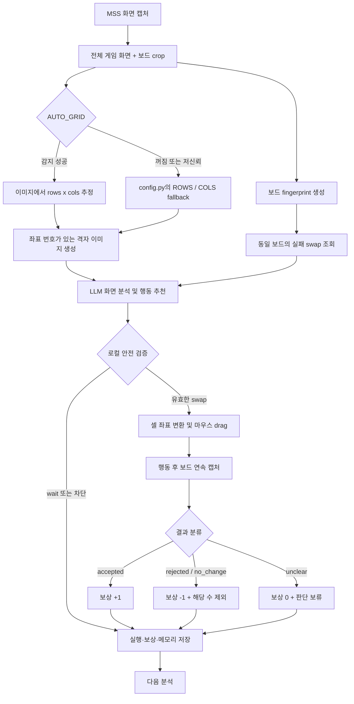

# Candy Crush Soda LLM Agent

Candy Crush Soda 화면을 캡처해 비전 LLM으로 분석하고, 안전 검증을 통과한 인접 셀 `swap`을 실행하는 실험용 에이전트입니다. 행동 뒤 보드 변화를 관찰해 실패한 수를 기억하고, 같은 보드에서 해당 수와 역방향 수를 다시 추천하지 않도록 구성되어 있습니다.

또한 `Survey Mode`로 게임 플레이 자체가 아니라 화면 구조, 버튼, 보상, 부스터, 진행 UI, 등급 검토용 변수명을 스크린샷과 함께 기록하고 Markdown 보고서를 생성할 수 있습니다.

## 주요 기능

- MSS로 전체 게임 화면과 보드 영역을 각각 캡처
- 이미지의 반복 경계로 현재 보드의 행과 열 자동 추정
- 자동 추정의 신뢰도가 낮으면 `config.py`의 `ROWS`, `COLS` 사용
- 전체 화면은 UI 상태 확인용, 격자 보드는 좌표 판단용으로 LLM에 전송
- `playing + stable` 상태의 인접 셀 `swap`만 안전 검증 통과
- 행동 후 보드를 연속 캡처해 `accepted`, `rejected`, `no_change`, `unclear`로 분류
- 같은 보드에서 실패한 `swap`과 역방향 `swap`을 다음 판단에서 제외
- 판단, 캡처 이미지, 보상, 메모리를 JSONL로 저장
- 전체 화면은 `low`, 보드는 `high` detail로 보내 응답 시간과 좌표 정확도의 균형 유지
- 조사 모드에서 `playing_board`, `level_complete`, `reward_popup`, `shop_or_currency` 같은 화면 타입을 기록
- 조사 모드에서 안전 버튼, 진행 버튼, 구조 탐색 버튼과 결제/광고/로그인 위험 후보를 분리
- 조사 로그의 화면/요소/버튼 중복 키를 만들어 반복 수집을 줄이고 Markdown 보고서 생성

기본값은 `DRY_RUN=true`입니다. 이 상태에서는 LLM 분석과 좌표 검증은 수행하지만 실제 마우스 드래그는 하지 않습니다.

## 실행 구조



## 처리 흐름

1. `main.py`가 전체 화면과 `BOARD_OFFSET` 영역을 캡처합니다.
2. `grid_detector.py`가 보드 경계의 반복 간격으로 행과 열을 추정합니다.
3. 감지 신뢰도나 셀 비율이 기준을 통과하지 못하면 고정 `ROWS`, `COLS`로 되돌아갑니다.
4. 현재 보드 fingerprint로 `memory.jsonl`에서 같은 보드의 실패 수를 최대 5개 찾습니다.
5. LLM이 전체 UI와 격자 보드를 보고 `wait` 또는 `swap`을 반환합니다.
6. 로컬 검증기가 상태, 신뢰도, 좌표 범위, 인접 여부, 과거 실패 수 여부를 다시 확인합니다.
7. 실제 드래그 뒤 최대 4초 동안 보드를 관찰하고 결과와 보상을 저장합니다.

### 행동 결과

| 결과 | 의미 | 보상 | 다음 판단 |
| --- | --- | ---: | --- |
| `accepted` | 최종 보드 변화가 충분함 | `+1` | 정상 진행 |
| `rejected` | 드래그 중 변화 후 원래 보드로 복귀 | `-1` | 같은 수와 역방향 수 제외 |
| `no_change` | 드래그 뒤 의미 있는 변화가 없음 | `-1` | 같은 수와 역방향 수 제외 |
| `unclear` | 제한 시간 안에 결과가 안정되지 않음 | `0` | 판단 보류 |

포커스, 권한, 마우스 제어 오류 같은 실행 환경 문제는 게임 규칙 실패로 학습하지 않고 보상 `0`으로 저장합니다.

## 설치

```bash
python -m venv .venv
source .venv/bin/activate
pip install -r candy_soda_agent/requirements.txt
```

현재 사용 중인 Conda 환경으로 실행할 수도 있습니다.

```bash
/opt/anaconda3/envs/test/bin/python candy_soda_agent/main.py --once
```

## 설정

`candy_soda_agent/.env.example`을 참고해 `candy_soda_agent/.env`를 설정합니다. 실제 API 키는 저장소에 커밋하지 않습니다.

```env
OPENAI_API_KEY=
OPENAI_MODEL=gpt-5-mini
FULL_IMAGE_DETAIL=low
BOARD_IMAGE_DETAIL=high
LLM_MAX_OUTPUT_TOKENS=700
SURVEY_LLM_MAX_OUTPUT_TOKENS=1200
AUTO_GRID=true
MONITOR_INDEX=1
CAPTURE_MODE=window
DRY_RUN=true
SURVEY_ALLOW_TAPS=false
GAME_WINDOW_TITLE=BlueStacks
```

주요 설정은 다음과 같습니다.

| 설정 | 설명 |
| --- | --- |
| `BOARD_OFFSET` | 선택한 모니터 기준 게임 보드 영역 |
| `ROWS`, `COLS` | 자동 그리드 감지 실패 시 사용할 fallback 값 |
| `AUTO_GRID` | 이미지 기반 행·열 자동 감지 사용 여부 |
| `CAPTURE_MODE` | `board`, `window`, `monitor` 중 전송 범위 선택 |
| `DRY_RUN` | `true`면 실제 마우스 동작 차단 |
| `GAME_WINDOW_TITLE` | 실제 조작을 허용할 앱 이름, 예: `BlueStacks` |
| `LLM_MAX_OUTPUT_TOKENS` | LLM 응답 최대 토큰 수 |
| `SURVEY_ALLOW_TAPS` | 조사 모드에서 안전 후보 버튼 실제 클릭 허용 여부 |
| `--survey-taps` | `.env`를 바꾸지 않고 이번 조사 실행에서 안전 후보 버튼 탭 허용 |
| `SURVEY_MIN_BUTTON_CONFIDENCE` | 조사 모드 버튼 후보 최소 신뢰도 |
| `SURVEY_DEDUP_SCAN_LIMIT` | 중복 화면/요소 판단에 참고할 최근 조사 기록 수 |
| `SURVEY_LLM_MAX_OUTPUT_TOKENS` | 조사 모드 LLM 응답 최대 토큰 수 |

`BOARD_OFFSET`과 `WINDOW_OFFSET`은 레이아웃이나 해상도가 바뀌면 다시 맞춰야 합니다. 자동 그리드는 행·열 수를 찾지만 보드 바깥 좌표 자체를 자동으로 찾지는 않습니다.

## 실행

```bash
# 현재 화면을 한 번 분석하고 종료
/opt/anaconda3/envs/test/bin/python candy_soda_agent/main.py --once

# 안정된 새 보드를 계속 자동 분석
/opt/anaconda3/envs/test/bin/python candy_soda_agent/main.py --auto

# 현재 화면을 한 번 게임 구조 조사 기록으로 저장
/opt/anaconda3/envs/test/bin/python candy_soda_agent/main.py --survey-once

# 안정된 새 화면을 계속 게임 구조 조사
/opt/anaconda3/envs/test/bin/python candy_soda_agent/main.py --survey-auto

# 조사 중 Next/Continue/닫기 같은 안전 후보 버튼까지 실제 탐색
SURVEY_ALLOW_TAPS=true /opt/anaconda3/envs/test/bin/python candy_soda_agent/main.py --survey-auto

# 같은 동작을 CLI 옵션으로 켜기
/opt/anaconda3/envs/test/bin/python candy_soda_agent/main.py --survey-auto --survey-taps

# 저장된 조사 로그로 Markdown 보고서 생성
/opt/anaconda3/envs/test/bin/python candy_soda_agent/main.py --survey-report

# 캡처 영역과 자동 감지된 격자 확인
/opt/anaconda3/envs/test/bin/python candy_soda_agent/preview_capture.py

# 보드 좌표 보정
/opt/anaconda3/envs/test/bin/python candy_soda_agent/calibrate_region.py
```

`--hotkeys`를 함께 사용하면 F8은 한 번 분석, F9는 자동 분석 시작·중지, ESC는 종료입니다. macOS에서는 단축키 라이브러리 문제를 피하기 위해 기본 실행 방식으로 `--once` 또는 `--auto`를 권장합니다.

실제 드래그 전에는 `DRY_RUN=true`로 캡처 영역, 격자 번호, 추천 좌표를 먼저 확인하세요. `DRY_RUN=false`에서는 macOS의 **화면 기록**과 **손쉬운 사용** 권한이 실행 주체인 Terminal, iTerm 또는 VS Code에 필요합니다.

조사 모드의 버튼 탐색은 보수적으로 동작합니다. `DRY_RUN=false`와 `SURVEY_ALLOW_TAPS=true`가 모두 설정되어야 실제 클릭이 일어나며, 구매, 광고 시청, 로그인, 권한 요청 후보는 기록만 하고 클릭하지 않습니다.

## 콘솔 확인 항목

```text
[GRID]    감지된 행·열, 신뢰도, auto/fallback 여부
[MEMORY]  같은 보드에서 제외한 실패 swap 수
[TIMING]  이미지 인코딩, API 응답, 전체 분석 시간
[OUTCOME] 행동 결과와 peak/final 화면 변화량
```

## 저장 결과

실행 결과는 명령을 실행한 현재 디렉터리를 기준으로 `output/`과 `memory.jsonl`에 저장됩니다. 아래처럼 저장소 루트에서 실행하면 저장소 루트 아래에 생성됩니다.

```text
output/
├── captures/       분석 전후 이미지
├── runs.jsonl      LLM 판단, 그리드 정보, 검증 결과
├── game_survey.jsonl       게임 구조 조사 로그
└── game_survey_report.md   조사 로그 기반 Markdown 보고서
memory.jsonl        행동 결과, 보상, fingerprint, 재사용할 교훈
```

## 프로젝트 구조

```text
SugarCrushSoda_GA/
├── README.md
└── candy_soda_agent/
    ├── main.py                 캡처·분석·실행 루프
    ├── agent.py                LLM 요청과 응답 안전 검증
    ├── schemas.py              구조화 응답 모델
    ├── capture.py              MSS 캡처와 프레임 차이 계산
    ├── capture_modes.py        board/window/monitor 캡처 묶음
    ├── grid_detector.py        이미지 기반 행·열 자동 감지
    ├── image_utils.py          격자 오버레이와 fingerprint
    ├── coordinate_mapper.py    셀 번호를 화면 좌표로 변환
    ├── action_executor.py      활성 앱 확인과 마우스 드래그
    ├── reward.py               행동 결과 분류와 보상 계산
    ├── survey.py               게임 구조 조사용 LLM 요청
    ├── survey_utils.py         조사 중복 키와 버튼 우선순위
    ├── survey_report.py        조사 보고서 생성
    ├── storage.py              이미지·JSONL·실패 수·조사 로그
    ├── preview_capture.py      캡처와 격자 미리보기
    ├── calibrate_region.py     보드 영역 보정
    ├── config.py               좌표·임계값·실행 설정
    ├── requirements.txt
    └── tests/
```

## 현재 검증 상태

- 자동 그리드 감지부터 동적 좌표 실행, macOS 앱 활성화, 행동 결과 분류, 실패 수 조회, 조사 중복 처리까지 단위 테스트 35개가 통과합니다.
- 실제 API 호출과 BlueStacks 마우스 드래그는 사용자 환경에서 별도 확인이 필요합니다.

이 프로젝트는 화면 변화량을 성공 신호로 사용하는 실험 단계입니다. 실제 점수 증가나 목표 달성을 직접 판정하는 게임 규칙 엔진은 아직 포함하지 않습니다.
