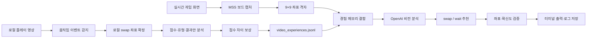

# Candy Crush Soda Vision Agent

Candy Crush Soda의 보드 화면을 OpenAI 비전 모델로 분석해 **다음 행동을 추천**하고, 녹화 영상에서 플레이 경험과 점수 변화를 추출해 **프롬프트 기반 보상 메모리**로 활용하는 Windows용 실험 프로젝트입니다.

> 이 프로젝트는 추천·관찰 도구입니다. 게임을 자동으로 클릭하지 않으며, 모든 수를 계산해 수학적으로 최적인 행동을 보장하는 솔버도 아닙니다.

## 한눈에 보기

| 영역 | 현재 상태 | 설명 |
|---|---:|---|
| 실시간 보드 캡처 | 구현됨 | MSS로 지정 모니터의 보드 영역을 캡처 |
| 다음 행동 추천 | 구현됨 | `swap` 또는 `wait`, 좌표, 이유, 확신도 출력 |
| 자동 분석 | 구현됨 | 안정된 새 보드를 감지해 일정 간격으로 분석 |
| 추천 형식 검증 | 구현됨 | 좌표 범위, 상하좌우 인접성, 최소 확신도 확인 |
| API 사용량 관리 | 구현됨 | 호출 수, 토큰, 추정 비용 및 실행별 한도 관리 |
| 영상 이벤트 감지 | 구현됨 | 20FPS로 9×9 셀별 변화를 로컬 검사 |
| 영상 최초 행동 추출 | **개선됨·실험 단계** | 반복 확인된 로컬 좌표를 실제 swap으로 확정 |
| 보상 메모리 | 조건부 구현 | 유효한 영상 경험이 저장되어야 활성화됨 |
| 오프라인 평가 | 조건부 구현 | 추천 행동과 영상 플레이어의 행동이 같은지 비교 |
| 자동 마우스 조작 | 미구현 | 추천만 하고 실제 게임 입력은 하지 않음 |
| 게임 화면 HUD | 미구현 | 추천 결과는 게임 위가 아니라 터미널에 출력 |
| 예상 획득 점수 | 미구현 | 추천 행동의 미래 점수를 계산하지 않음 |
| 최적 행동 솔버 | 미구현 | 가능한 모든 수의 시뮬레이션·최적화 기능 없음 |

## 현재 중요한 상태

현재 설정된 로컬 영상은 OpenCV에서 정상적으로 열리고 디코딩됩니다.

- 해상도: 1280×720
- 프레임 속도: 60 FPS
- 길이: 약 30분 8.6초

**영상 파일 인식과 행동 인식은 서로 다른 문제**입니다. 기존 파이프라인은 최초 스왑보다 뒤의 폭발·연쇄 장면을 선택했지만, 현재 버전은 20FPS 셀 단위 검출로 최초 인접 두 칸을 먼저 확인합니다.

현재 버전에서 모델은 로컬 swap 좌표를 재판정하지 않습니다. 로컬 검출기가
통과시킨 인접 두 칸을 실제 행동으로 저장하고, 모델에는 전후 점수·행동
유형·결과만 요청합니다. 결과 확신도가 낮거나 유형이 불명확해도 행동은
폐기하지 않으며, 점수를 읽지 못한 경우에만 보상 통계에서 제외합니다.

현재 기본 안전장치는 다음과 같습니다.

- 인접 두 칸 변화가 3샘플 중 2번 이상 확인된 경우만 API 호출
- 폭발·팝업처럼 변화가 여러 칸에 퍼진 장면은 API 호출 없이 건너뜀
- 학습 실행당 API 후보 시도 기본 12개
- 영상 실행당 최대 24회 또는 150,000토큰

## 전체 구조



### 실시간 분석 흐름

```text
게임 화면
→ 지정 모니터의 보드 영역 캡처
→ 1부터 시작하는 9×9 행·열 격자 추가
→ 저장된 영상 경험을 요약한 메모리 결합
→ OpenAI Responses API로 이미지 전송
→ 구조화된 AgentDecision 수신
→ 좌표 범위·인접성·최소 확신도 검증
→ 터미널 출력 및 이미지·JSONL 저장
```

### 영상 경험 추출 흐름

```text
로컬 MP4
→ 고정 간격으로 프레임 샘플링
→ 보드와 현재 점수 ROI 추출
→ 안정 상태 뒤 인접 두 칸의 반복 변화를 로컬 검출
→ 강한 로컬 후보 좌표를 실제 swap으로 확정
→ BEFORE 전체·두 칸 확대 ACTION·AFTER 전체 이미지 구성
→ 모델은 행동 유형, 전후 점수, 결과만 분석
→ score_after - score_before를 보상으로 저장
→ 다음 실시간 추천의 참고 메모리로 사용
```

## 여기서 말하는 “학습”

현재 구현은 다음 방식이 아닙니다.

- 모델 파인튜닝
- 강화학습
- Q-learning
- 신경망 가중치 업데이트
- 보드 상태별 행동 가치 함수 학습

대신 `memory.py`가 유효한 영상 경험을 읽어 다음 정보를 최대 900자의 텍스트로 요약합니다.

- 행동 유형별 평균·중앙값 점수 상승 상위 4개
- 높은 보상을 얻은 실제 사례 최대 2개

이 요약이 다음 OpenAI 요청의 프롬프트에 참고 자료로 추가됩니다. 따라서 정확한 표현은 **영상 기반 경험 메모리 구축** 또는 **과거 보상을 참고하는 프롬프트 기반 추천**입니다.

## 추천 결과의 의미

실시간 분석은 다음과 같은 구조화된 결과를 반환합니다.

```json
{
  "board_status": "stable",
  "board_summary": "현재 보드의 간단한 설명",
  "move_type": "create_special",
  "visible_elements": ["빨간 사탕", "파란 사탕"],
  "action": "swap",
  "source": {"row": 4, "col": 5},
  "target": {"row": 4, "col": 6},
  "confidence": 0.78,
  "reason": "가로 방향 특수 사탕 생성 가능성이 높습니다."
}
```

`confidence`는 모델이 스스로 보고한 **추천 확신도**입니다. 다음 값을 의미하지 않습니다.

- 예상 획득 점수
- 행동의 최적도 점수
- 성공 확률을 보정한 통계값
- 가능한 모든 행동 중 순위

또한 `valid=true`는 좌표와 형식이 기본 규칙을 통과했다는 뜻일 뿐, 실제 매치 성립이나 전략적 최적성을 검증했다는 뜻은 아닙니다.

## 프로젝트 구성

```text
candy_soda_agent/
├─ main.py                  # 실시간 캡처, F8/F9 루프, 추천 출력
├─ config.py                # 화면·영상 ROI, 모델, 임계값, 예산 설정
├─ capture.py               # MSS 캡처와 프레임 차이 계산
├─ image_utils.py           # 격자, ROI, Base64, 영상 관찰 이미지
├─ schemas.py               # 추천·영상 결과 구조화 스키마
├─ agent.py                 # OpenAI 호출, 추천·영상 결과 분석
├─ usage.py                 # API 호출·토큰·추정 비용 관리
├─ memory.py                # 영상 경험을 프롬프트 메모리로 요약
├─ storage.py               # 실시간 분석 이미지와 JSONL 저장
├─ calibrate_region.py      # 실시간 보드 영역 선택
├─ preview_capture.py       # API 없이 캡처·격자 미리보기
├─ calibrate_video.py       # 영상의 보드·점수 ROI 선택
├─ video_pipeline.py        # 영상 경험 추출 및 평가
├─ video_detection.py       # 20FPS 셀 단위 최초 swap 검출
├─ evaluate_video.py        # 메모리 크기별 정확도 집계·그래프
├─ tests/
│  └─ test_core.py          # API를 모킹한 핵심 로직 테스트
├─ requirements.txt         # Python 의존성
├─ README.md                # 현재 문서
└─ output/                  # 실행 시 생성되는 결과
```

## 실행 환경

- Windows 데스크톱 GUI 환경
- Python 3.10 이상
- OpenAI API 키와 인터넷 연결
- 화면 캡처가 가능한 게임 창 또는 녹화 영상

`mss`, OpenCV GUI, 전역 단축키를 사용하므로 headless 서버 환경에는 적합하지 않습니다.

## 설치

프로젝트 폴더에서 다음 명령을 실행합니다.

```powershell
cd C:\Users\user\OneDrive\Documents\workspace_py\candy_soda_agent\candy_soda_agent

python -m venv .venv
.\.venv\Scripts\Activate.ps1
python -m pip install --upgrade pip
python -m pip install -r requirements.txt
```

PowerShell 정책 때문에 가상환경 활성화가 막히면 현재 세션에만 다음 설정을 적용할 수 있습니다.

```powershell
Set-ExecutionPolicy -Scope Process Bypass
.\.venv\Scripts\Activate.ps1
```

또는 가상환경의 Python을 직접 실행합니다.

```powershell
.\.venv\Scripts\python.exe main.py
```

> `requirements.txt`는 현재 패키지 버전을 고정하지 않습니다. 설치 시점에 따라 동작 차이가 생길 수 있습니다.

## 환경변수

`config.py`와 같은 폴더에 `.env`를 만듭니다.

```dotenv
OPENAI_API_KEY=발급받은_API_KEY
OPENAI_MODEL=gpt-4o-mini-2024-07-18
OPENAI_IMAGE_DETAIL=low
OPENAI_VIDEO_IMAGE_DETAIL=low
CANDY_VIDEO_PATH=C:\Users\사용자이름\Videos\training.mp4
```

| 변수 | 필수 | 기본값·설명 |
|---|---:|---|
| `OPENAI_API_KEY` | 필수 | OpenAI API 인증 키 |
| `OPENAI_MODEL` | 선택 | `gpt-4o-mini-2024-07-18` |
| `OPENAI_IMAGE_DETAIL` | 선택 | 실시간 이미지 상세도, `low/high/auto` |
| `OPENAI_VIDEO_IMAGE_DETAIL` | 선택 | 영상 이미지 상세도, 기본값은 실시간 설정 |
| `CANDY_VIDEO_PATH` | 선택 | 학습·평가에 사용할 로컬 영상 |
| `OPENAI_INPUT_USD_PER_MILLION_TOKENS` | 선택 | 비용 추정용 입력 단가 |
| `OPENAI_CACHED_INPUT_USD_PER_MILLION_TOKENS` | 선택 | 비용 추정용 캐시 입력 단가 |
| `OPENAI_OUTPUT_USD_PER_MILLION_TOKENS` | 선택 | 비용 추정용 출력 단가 |

비용 단가는 실제 청구액이 아니라 프로그램의 **추정값 계산용 설정**입니다. 모델을 변경하면 현재 가격에 맞게 직접 갱신해야 합니다.

`.env`는 `.gitignore`에 포함되어 있습니다. API 키를 소스 코드, README, 로그 또는 Git 저장소에 넣지 마세요.

## 1. 실시간 보드 보정

### 모니터 선택

`config.py`에서 게임이 표시된 실제 모니터 번호를 설정합니다.

```python
MONITOR_INDEX = 2
```

MSS의 0번은 모든 모니터를 합친 영역이므로 이 프로젝트에서는 1 이상의 실제 모니터 번호를 사용합니다.

### 보드 영역 선택

```powershell
python calibrate_region.py
```

게임의 실제 퍼즐 보드만 드래그하고 Enter 또는 Space를 누릅니다. 출력된 `BOARD_OFFSET`을 `config.py`에 수동으로 복사합니다.

> 보정 도구는 `config.py`를 자동 수정하지 않습니다.

### API 없이 미리보기

```powershell
python preview_capture.py
```

다음을 확인합니다.

- 보드 전체가 잘리지 않고 들어오는지
- 게임 외 UI가 과도하게 포함되지 않는지
- 9×9 격자가 실제 칸 경계와 맞는지
- 행 번호는 위에서 아래, 열 번호는 왼쪽에서 오른쪽인지

결과는 다음 위치에도 저장됩니다.

```text
output/preview_raw.png
output/preview_grid.png
```

창 위치, 크기, 화면 배율 또는 모니터가 바뀌면 다시 보정해야 합니다.

## 2. 실시간 추천 실행

```powershell
python main.py
```

| 키 | 동작 |
|---|---|
| `F8` | 현재 화면을 즉시 한 번 분석 |
| `F9` | 안정된 새 보드 자동 분석 시작·중지 |
| `ESC` | 프로그램 종료 |

### F8

F8은 현재 화면을 바로 전송합니다. 애니메이션, 팝업 또는 화면 전환 중에 누르면 불필요한 호출이 발생할 수 있으므로 보드가 멈춘 상태에서 사용하세요.

### F9

기본 설정에서 자동 모드는 다음 조건을 만족할 때만 요청합니다.

1. 0.5초마다 화면 캡처
2. 화면 차이가 안정 임계값 미만인 상태가 3회 연속
3. 이전에 전송한 보드와 충분히 다름
4. 마지막 API 호출 후 15초 이상 경과

프로그램은 OpenCV 미리보기 창에 원본 보드를 표시하고, 추천 좌표·이유·확신도는 **터미널 JSON**으로 출력합니다. 게임 화면 위에 화살표나 점수를 그리지는 않습니다.

## 3. 영상 ROI 보정

다른 해상도, 레벨 또는 레이아웃의 영상을 사용할 때 실행합니다.

```powershell
python calibrate_video.py `
  --video "C:\Users\user\Videos\training.mp4" `
  --time 30
```

1. 해당 시점의 전체 9×9 보드를 선택합니다.
2. 현재 점수가 표시되는 패널을 선택합니다.
3. 출력된 `VIDEO_BOARD_ROI`와 `VIDEO_SCORE_ROI`를 `config.py`에 수동으로 복사합니다.

영상 중간에 레벨이나 보드 위치가 바뀌면 하나의 고정 ROI로 전체 영상을 처리할 수 없습니다. 같은 레이아웃 구간별로 나누어 처리해야 합니다.

## 4. 영상 경험 메모리 구축

첫 플레이 구간의 20초부터 10분 동안 후보 이벤트를 처리하는 예시입니다.

```powershell
python video_pipeline.py `
  --mode train `
  --start 20 `
  --end 620 `
  --max-events 40 `
  --max-attempts 12 `
  --label train_10m
```

주의할 점:

- `--max-events`는 감지한 이벤트 수가 아니라 **검증 후 저장에 성공한 이벤트 수**입니다.
- `--max-attempts`는 API로 보내는 로컬 확인 완료 후보 수이며 저장 성공 수와 별도입니다.
- 40개가 먼저 저장되면 10분 전체를 읽기 전에 종료됩니다.
- 기본값에서는 저장 수와 관계없이 API 후보 12개에서 중단됩니다.
- 영상 모드는 실행당 최대 24회 또는 150,000토큰에서도 중단됩니다.
- 처음에는 `--max-attempts 3`으로 짧게 확인한 뒤 늘리는 것이 안전합니다.

### 최초 행동 검출 방식

설정된 60 FPS 영상은 0.05초 간격, 즉 20FPS로 로컬 검사합니다.

1. 조용한 보드가 연속 5샘플 유지된 뒤에만 후보 탐색을 시작합니다.
2. 각 프레임을 9×9로 나눠 셀별 변화량을 계산합니다.
3. 변화가 인접한 두 칸에 집중되고, 같은 쌍이 3샘플 중 2번 이상 확인되어야 합니다.
4. 최초 0.25초 안에서 같은 두 칸이 가장 선명한 프레임만 `ACTION`으로 선택합니다.
5. 여러 셀이 동시에 바뀌는 폭발·연쇄·팝업은 API 호출 전에 건너뜁니다.
6. 통과한 로컬 좌표를 실제 행동으로 저장하며 모델은 좌표를 재판정하지 않습니다.
7. `ACTION` 이미지는 교환 두 칸 주변의 BEFORE/ACTION 확대 비교본입니다.

실제 영상 20~80초 무과금 회귀 검사에서는 기존의 잘못된 25.50/30.50/36.50초 대신 실제 스왑 시점인 약 24.60/29.60/34.60초를 검출했습니다. 다만 영상 레이아웃과 이펙트가 달라지면 임계값 재조정이 필요할 수 있습니다.

## 5. 영상 평가

학습에 사용하지 않은 별도 구간에서 평가하는 것이 좋습니다.

```powershell
python video_pipeline.py `
  --mode evaluate `
  --start 620 `
  --end 920 `
  --max-events 15 `
  --memory-limit 40 `
  --label memory_40

python evaluate_video.py
```

평가 항목은 추천한 두 좌표가 영상 플레이어가 실제로 교환한 두 좌표와 정확히 같은지 여부입니다.

이 평가는 다음을 증명하지 않습니다.

- 영상 플레이어의 행동이 최적이었다는 것
- 추천 행동의 예상 점수
- 추천 행동의 수학적 최적성
- 모델이 게임 규칙 전체를 이해했다는 것

`evaluate_video.py`는 실험 라벨별 정확도를 출력하고 다음 그래프를 만듭니다.

```text
output/memory_accuracy.png
```

## API 호출과 토큰 한도

| 실행 경로 | 기본 호출 한도 | 기본 토큰 한도 | 참고 |
|---|---:|---:|---|
| 실시간 `main.py` | 120회 | 450,000 | F8과 F9가 같은 예산 공유 |
| 영상 `video_pipeline.py` | 24회 | 150,000 | 학습·평가 실행마다 새 예산 |

- 실패한 API 요청과 폐기된 영상 이벤트도 호출 횟수에 포함됩니다.
- 로컬 셀 검사를 통과하지 못한 장면은 API를 호출하지 않습니다.
- 학습 후보는 일반적으로 이벤트당 1회 라벨링 요청을 사용합니다.
- 평가 후보는 추천 1회와 실제 행동 라벨링 1회로 보통 2회를 사용합니다.
- 학습은 기본 12개, 평가는 기본 6개의 확인된 후보까지만 시도합니다.
- 실행 중에는 실제 입력·출력 토큰과 설정 단가 기준 추정 비용이 표시됩니다.

## 출력 파일

| 경로 | 내용 |
|---|---|
| `output/preview_raw.png` | API 전송 전 원본 보드 미리보기 |
| `output/preview_grid.png` | 행·열 격자가 추가된 미리보기 |
| `output/captures/` | 실시간 분석의 원본·격자 이미지 |
| `output/runs.jsonl` | 실시간 추천, 검증, 토큰, 추정 비용 |
| `output/video_experiences.jsonl` | 로컬 확정 행동과 모델의 결과 분석 |
| `output/video_evaluations.jsonl` | 추천과 영상 행동의 일치 결과 |
| `output/video_usage.jsonl` | 영상 실행별 호출·토큰·비용·종료 사유 |
| `output/video_discards.jsonl` | 로컬 검출 탈락 또는 API 오류 사건과 사유 |
| `output/video_captures/` | 유효·폐기 이벤트의 BEFORE/ACTION/AFTER 이미지 |
| `output/memory_accuracy.png` | 메모리 크기별 정확도 그래프 |

JSONL 파일은 기존 내용을 덮어쓰지 않고 실행할 때마다 뒤에 추가합니다.

로컬 확인 조건을 통과하지 못한 사건과 API 오류는 `video_discards.jsonl`에
남습니다. 결과 분석의 낮은 확신도는 폐기 조건이 아니며
`outcome_confidence`로 경험에 기록됩니다. 로컬 진단 이미지는 실행당
최대 30건까지 저장합니다.

## 주요 설정

### 실시간

| 설정 | 기본값 | 의미 |
|---|---:|---|
| `ROWS`, `COLS` | 9, 9 | 보드 행·열 |
| `CAPTURE_INTERVAL` | 0.5초 | 자동 모드 캡처 간격 |
| `STABLE_THRESHOLD` | 0.02 | 안정 화면 판단 기준 |
| `STABLE_FRAME_COUNT` | 3 | 필요한 연속 안정 프레임 |
| `NEW_BOARD_THRESHOLD` | 0.055 | 새 보드 판단 기준 |
| `API_COOLDOWN` | 15초 | 자동 API 호출 최소 간격 |
| `MIN_CONFIDENCE` | 0.55 | 추천 검증 최소 확신도 |

`SCORE_OFFSET`은 현재 실시간 추천 루프에서 사용되지 않습니다. 전후 점수 필드는 영상 라벨링 경로에만 있습니다.

### 영상

| 설정 | 기본값 | 의미 |
|---|---:|---|
| `VIDEO_DEFAULT_START_SECONDS` | 20초 | 기본 시작 시점 |
| `VIDEO_SAMPLE_SECONDS` | 0.05초 | 로컬 프레임 검사 간격 |
| `VIDEO_QUIET_THRESHOLD` | 0.0025 | 조용한 연속 프레임 판정 |
| `VIDEO_PRE_ACTION_QUIET_SAMPLES` | 5 | swap 탐색 전 필요한 조용한 샘플 |
| `VIDEO_SWAP_CONFIRM_WINDOW_SAMPLES` | 3 | 같은 인접 쌍 확인 구간 |
| `VIDEO_SWAP_CONFIRM_REQUIRED_SAMPLES` | 2 | 후보 확정에 필요한 반복 횟수 |
| `VIDEO_ACTION_WINDOW_SECONDS` | 0.25초 | ACTION 프레임 선택 가능 구간 |
| `VIDEO_AFTER_STABLE_SAMPLES` | 12 | 반응 종료에 필요한 조용한 샘플 |
| `VIDEO_MAX_EVENT_SECONDS` | 8초 | 하나의 이벤트 최대 길이 |
| `VIDEO_EVENT_COOLDOWN_SECONDS` | 0.8초 | 이벤트 간 최소 간격 |
| `MAX_TRAIN_EVENTS` | 40 | 기본 유효 학습 경험 상한 |
| `MAX_EVALUATION_EVENTS` | 15 | 기본 유효 평가 경험 상한 |
| `MAX_TRAIN_ATTEMPTS` | 12 | 학습 API 후보 시도 상한 |
| `MAX_EVALUATION_ATTEMPTS` | 6 | 평가 API 후보 시도 상한 |

임계값은 영상 해상도, 압축, 프레임 속도, 이펙트에 따라 다시 조정해야 할 수 있습니다.

## 테스트

API 네트워크 호출 없이 핵심 로직을 검사합니다.

```powershell
python -m unittest discover -s tests -v
```

현재 구성은 다음을 검사합니다.

- API 사용량 합산과 호출 한도
- 격자와 영상 관찰 이미지 크기
- ROI 범위 검증
- 구조화된 추천과 영상 라벨 처리
- swap 좌표 인접성 및 행동 일치
- 실제 구성 영상의 이벤트 루프 스모크 테스트

실영상 스모크 테스트는 API 호출과 JSONL 저장을 모킹합니다. 다만 현재 구현상 구성된 영상이 존재하면 실행 시작 전 API 키 존재 검사를 통과해야 합니다.

추가 정적 검사는 해당 도구가 설치된 환경에서 실행할 수 있습니다.

```powershell
python -m compileall -q .
ruff check .
mypy . --ignore-missing-imports --exclude __pycache__
```

## 문제 해결

### `OPENAI_API_KEY가 설정되지 않았습니다`

- `.env`가 `config.py`와 같은 폴더에 있는지 확인합니다.
- 변수 이름이 정확히 `OPENAI_API_KEY`인지 확인합니다.
- 키 값을 터미널 캡처나 로그에 노출하지 않습니다.

### 캡처가 엉뚱한 위치를 보여줌

1. `MONITOR_INDEX`를 확인합니다.
2. 게임 창 위치와 화면 배율을 고정합니다.
3. `calibrate_region.py`로 다시 선택합니다.
4. API 호출 전에 `preview_capture.py`로 확인합니다.

### F8/F9/ESC가 작동하지 않음

- `main.py` 콘솔이 실행 중인지 확인합니다.
- 다른 프로그램이 같은 단축키를 선점했는지 확인합니다.
- Windows 보안 정책이 전역 키보드 훅을 차단하는지 확인합니다.

### 영상 파일을 열 수 없음

- `CANDY_VIDEO_PATH`의 파일 존재 여부를 확인합니다.
- OpenCV가 해당 코덱을 디코딩할 수 있는지 확인합니다.
- 다른 해상도라면 `calibrate_video.py`로 ROI를 다시 선택합니다.

### 영상 경험이 저장되지 않음

- `[LOCAL SKIP]`만 반복되면 보드 ROI와 로컬 셀 변화 임계값을 확인합니다.
- `[EVENT ERROR]`가 나오면 오류 메시지와 `video_discards.jsonl`을 확인합니다.
- 처음에는 `--max-attempts 3`으로 시도 수를 낮춥니다.
- `VIDEO_SCORE_ROI`는 현재 점수 숫자가 선명히 들어오도록 선택합니다.
- 다른 영상이라면 셀 변화 임계값을 다시 측정해야 할 수 있습니다.

### 이미지 저장 실패

- `output/` 쓰기 권한을 확인합니다.
- OneDrive 동기화 잠금이나 충돌 여부를 확인합니다.
- 디스크 여유 공간을 확인합니다.

## 현재 범위의 결론

이 프로젝트는 다음 용도로 사용할 수 있습니다.

- 현재 보드의 다음 행동 후보 추천
- 추천 좌표·유형·이유·모델 확신도 기록
- 실시간 API 사용량과 추정 비용 추적
- 영상에서 유효한 행동이 추출된 경우 점수 기반 경험 메모리 구축
- 추천과 녹화된 플레이어 행동의 오프라인 일치율 비교

현재는 다음 용도로 사용할 수 없습니다.

- 완전 자동 게임 플레이
- 추천 행동의 실시간 예상 점수 표시
- 모든 가능한 수를 계산한 최적 행동 보장
- 사용자 행동의 실시간 사후 평가
- 안정적인 30분 영상 자동 학습 보장

다음 개발 우선순위는 **점수 ROI·OCR 개선 → 다양한 레벨의 셀 검출 검증 → 실시간 결과 오버레이 → 행동 가치 점수화** 순서가 적절합니다.
